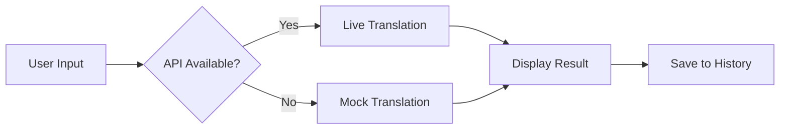

✨ Starry Translation — Frontend Portal

https://img.shields.io/badge/Vite-646CFF?style=for-the-badge&logo=vite&logoColor=white
https://img.shields.io/badge/React-20232A?style=for-the-badge&logo=react&logoColor=61DAFB
https://img.shields.io/badge/TypeScript-007ACC?style=for-the-badge&logo=typescript&logoColor=white
https://img.shields.io/badge/FastAPI-009688?style=for-the-badge&logo=fastapi&logoColor=white

A beautiful, lightweight web portal for the Starry Translation Service (STS). Built with modern web technologies to showcase translation, tone-preservation, and history features with seamless backend integration.

https://via.placeholder.com/800x400/0f172a/ffffff?text=Starry+Translation+Demo

🌟 About

This repository contains the frontend portal for the Starry Translation Service (STS) - a powerful translation platform that preserves tone and context. The portal demonstrates:

· Real-time translation with tone preservation
· Language detection and multi-language support
· Local history with quick re-run capabilities
· Offline-friendly mock translation fallback
· Production-ready Vite + React + TypeScript stack

🚀 Built to work seamlessly with the STS FastAPI backend, while maintaining full functionality in offline/demo scenarios.

🚀 Live Demos

Environment URL Status
Frontend (Vercel) starry-translation.vercel.app https://img.shields.io/badge/Status-Live-brightgreen
Backend API (Render) https://starry-translation.onrender.com https://img.shields.io/badge/Status-Online-success

✨ Features

🔄 Core Translation

· Live Translation via STS backend API
· Tone Preservation (formal, friendly, literal, etc.)
· Auto Language Detection
· Batch Translation support

🎨 User Experience

· Mock Translation Fallback for offline development
· Translation History with local storage
· Quick Re-run of past translations
· Responsive Design for all devices

🛠 Technical Excellence

· Vite for lightning-fast development
· React 18 with modern hooks
· TypeScript for type safety
· Production-optimized builds

📁 Repository Structure

```
starry-translation/
├── 📁 src/                    # Frontend source
│   ├── 📁 pages/             # React pages
│   │   └── Index.tsx         # Main portal
│   ├── 📁 components/        # UI components
│   │   ├── LanguageSelector/
│   │   ├── TranslationInput/
│   │   ├── TranslationResult/
│   │   └── HistoryPanel/
│   └── 📁 lib/               # Core utilities
│       ├── translationClient.ts  # Live API client
│       └── mockTranslation.ts    # Offline fallback
├── 📁 server/                # FastAPI backend
│   ├── 📁 app/              # Python application
│   ├── Dockerfile           # Container configuration
│   └── render.yaml          # Deployment config
├── package.json             # Frontend dependencies
└── README.md               # This file
```

🏁 Quick Start

Prerequisites

· Node.js 18+
· npm, yarn, or pnpm

Development Setup

1. Clone and install:

```bash
npm install
```

1. Configure environment:

```bash
# Create .env.local
echo "VITE_STS_API_URL=https://starry-translation.onrender.com" > .env.local
```

1. Start development server:

```bash
npm run dev
```

1. Open your browser to http://localhost:5173 and start translating! 🎉

⚙️ Configuration

Environment Variables

Variable Description Example
VITE_STS_API_URL STS backend base URL https://starry-translation.onrender.com

Example .env.local:

```env
VITE_STS_API_URL=https://starry-translation.onrender.com
```

🔧 Backend Development

Local Backend Setup

```bash
cd server

# Create virtual environment
python -m venv .venv
source .venv/bin/activate  # Windows: .venv\Scripts\activate

# Install dependencies
pip install -r requirements.txt

# Configure environment
cp example.env .env
# Edit .env with your configuration

# Start development server
uvicorn app.main:app --reload --host 0.0.0.0 --port 8000
```

Backend Environment Variables

Variable Purpose Required
HF_TOKEN Hugging Face inference Optional
FIREBASE_SERVICE_ACCOUNT_B64 Firestore integration Optional
FALLBACK_ONLY Skip local models Optional
DATABASE_URL Metrics storage Optional

Docker Deployment

```bash
cd server
docker build -t starry-translation .
docker run -p 8000:8000 starry-translation
```

🌐 API Reference

Translation Endpoint

POST /v1/translate

Request:

```json
{
  "content": "Hello, world!",
  "source_language": "auto",
  "target_language": "es",
  "tone": "friendly",
  "context": "casual_conversation"
}
```

Response:

```json
{
  "translated_text": "¡Hola, mundo!",
  "source_language": "en",
  "confidence": 0.95,
  "cache_hit": false,
  "model": "Hugging Face M2M100",
  "firestore_write": null
}
```

cURL Example:

```bash
curl -X POST "https://starry-translation.onrender.com/v1/translate" \
  -H "Content-Type: application/json" \
  -d '{
    "content": "Hello world",
    "target_language": "es",
    "tone": "friendly"
  }'
```

Additional Endpoints

· GET /v1/health - Service health check
· GET /v1/metrics - Performance metrics
· POST /v1/translate/batch - Batch translation

🔄 Translation Flow



The frontend intelligently falls back to mock translations when:

· Backend is unavailable
· Network errors occur
· Development/demo mode

🚀 Production Deployment

Vercel Deployment

1. Set environment variables in Vercel dashboard:
   · VITE_STS_API_URL: Your backend URL
2. Connect repository and deploy

⚠️ Important: Vite embeds environment variables at build time. Changes require re-deployment.

Build Process

```bash
npm run build        # Production build
npm run preview      # Local preview
```

📱 Mobile Integration

The STS API is mobile-ready! Here's a Kotlin snippet using Retrofit:

```kotlin
interface TranslationService {
    @POST("/v1/translate")
    suspend fun translate(@Body request: TranslationRequest): TranslationResponse
}

data class TranslationRequest(
    val content: String,
    val target_language: String,
    val source_language: String = "auto",
    val tone: String? = null
)
```

🛠 Troubleshooting

Common Issues

Issue Solution
Mock translations active Restart dev server after setting VITE_STS_API_URL
CORS errors Check server CORS_ALLOW_ORIGINS in app/core/config.py
Live translation fails Verify backend health at /v1/health
Environment variables not loading Re-deploy on Vercel after variable changes

Removing Mock Fallback

To enforce live-only translations, edit src/pages/Index.tsx:

```typescript
// Remove the try-catch fallback and use:
const result = await translateLive(input, config);
```

🤝 Contributing

We love contributions! Here's how to help:

1. Fork the repository
2. Create a feature branch: git checkout -b feature/amazing-feature
3. Commit changes: git commit -m 'Add amazing feature'
4. Push to branch: git push origin feature/amazing-feature
5. Open a Pull Request

Development Guidelines

· Keep frontend/backend changes in separate commits
· Include clear testing instructions in PRs
· Follow TypeScript and React best practices

📄 License & Credits

License: MIT License

Built with:

· Vite - Build tooling
· React - UI framework
· TypeScript - Type safety
· FastAPI - Backend API
· Tailwind CSS - Styling (if used)

---